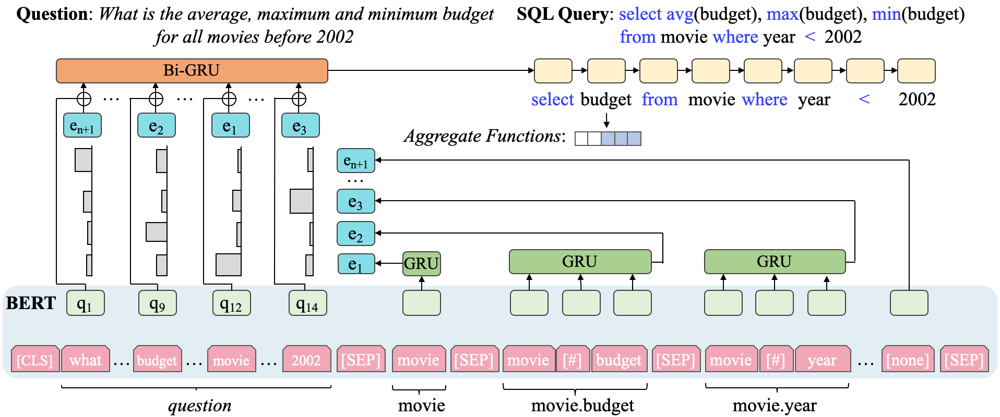

# SLSQL
Code and annotation for the EMNLP 2020 paper ["Re-examining the Role of Schema Linking in Text-to-SQL"](https://www.aclweb.org/anthology/2020.emnlp-main.564).

## Citation
``` bibtex
@inproceedings{emnlp20-examining,
    title = "Re-examining the Role of Schema Linking in Text-to-{SQL}",
    author = "Lei, Wenqiang and Wang, Weixin and Ma, Zhixin and Gan, Tian and Lu, Wei and Kan, Min-Yen and Chua, Tat-Seng",
    booktitle = "Proceedings of the 2020 Conference on Empirical Methods in Natural Language Processing (EMNLP)",
    month = nov,
    year = "2020",
    address = "Online",
    publisher = "Association for Computational Linguistics",
    pages = "6943--6954"
}
```

## Environment
Install some needed packages.
```
pip install -r requirements.txt
```
Download Stanford CoreNLP 3.9.2 from [the official website](https://stanfordnlp.github.io/CoreNLP/history.html) and decompress it under the `corenlp/` folder.

Download the Spider dataset and decompress it under the `data/` folder.

## Pre-processing
Run the following command to preprocess the corpus and annotation.
```
sh preprocess.sh
```

## Training
Train the *default* model:
```
python model/run.py --do_train --output_dir="output/default"
```
Train the *base* model:
```
python model/run.py --do_train --base --output_dir="output/base"
```
Train the *hard* variant:
```
python model/run.py --do_train --hard --output_dir="output/hard"
```
Train the *oracle* variant:
```
python model/run.py --do_train --hard --oracle --output_dir="output/oracle"
```

## Evaluation
The following command can be used to run a trained *hard* variant for evaluation.
```
python model/run.py --do_eval --hard --output_dir="output/hard" --bert_model="<saved_model_folder>"
```
Evaluation for other variants can be done using similar commands.
## Annotation
### Format
For each column/table/value reference in the question, the corresponding annotation contains the following fields.
+ `type`: the reference type, which can be `col`, `tbl` or `val`.
+ `id`: the index of the corresponding column or table.
+ `agg`: the aggregate functions, which can be `min`, `max`, `avg`, `sum` or `count`.
+ `op`: the operator, which can be `<`, `=`, `>`, etc.
+ `scope`: the scope, which can be `main` or `sub`, indicating whether the corresponding column/table/value exists in the main SQL clause.
+ `func`: the function in SQL query, which can be `sel`, `cmp`, `having`, `group`, `asc-order`, `desc-order`, etc.

The `agg` annotations indicate whether a reference is modified by some specific aggregate functions in NL and SQL query.
The `op` annotations are only applicable to value references, indicating the comparison operator in the corresponding SQL query. 
The `scope` annotations indicate whether a reference correspond to the column/table/value occurring in a SQL sub-clause.
The `func` annotations indicate the function of a reference in the corresponding SQL query.
Take "Find the name and email of the user whose name contains the word 'Swift'." as an example. The first "name" is for
display purpose in the SQL query, while the second "name" is for comparing with the value reference "Swift".

We only use `id` and `type` information in the SLSQL implementation. You may explore using other annotation fields in your research.

### Release Log
**2020-11-24:**  
v1.0.0 (compatible with the current version of Spider)

## Model Schematic
Here is a schematic diagram of the *hard* variant, which can help understand the model architecture.


## License
[MIT License](LICENSE)